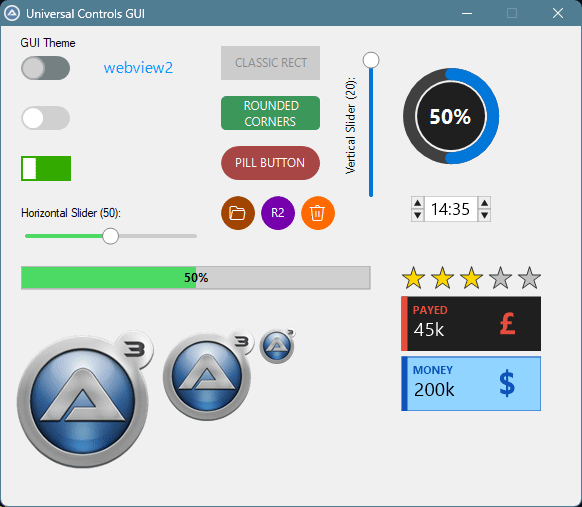

# 🎚️ UC_Framework
Universal Controls framework for custom GDI+ controls (Toggles, Sliders, etc.)

---


Hi everyone,

I'd like to share a project I've been working on: **UC\_Framework**. 
It is a lightweight framework designed to create modern, reactive, and highly customizable **GDI+ controls** for AutoIt.

My goal was to create a standardized, extensible way to introduce custom controls into AutoIt, moving away from static functions  
and towards a more "Object-Oriented" logic using **AutoIt Maps**

### Key Features:

- **Reactive Engine:** Property changes automatically trigger a redraw of the control.
- **Extensible Architecture:** The framework is designed as an "Engine."  
	Adding a new control (e.g., a Gauge or a Custom Listview) is just a matter of defining its properties in the Map and creating its Draw function.
- **Modern UI Elements:** Includes Toggles (Round/Rect), Sliders (Horizontal/Vertical), Custom Buttons (Classic/Rounded/Pill),,Links, labels, (more are coming).
- **Property Management:** Centralized property manager for easy control manipulation using
	```
	_UC_Set
	```
	and
	```
	_UC_Get
	```
  
- **Customization:** Full control over colors, corner radius, fonts, and tooltips.
- **Interactive:** Built-in support for hover states, click events, and keyboard accelerators.

### Technical Implementation:

The framework uses a **Global Map (ID 1)** to act as a Provider for system-wide constants, cursors, and shared resources,  
ensuring that your GUI remains lightweight and organized.

This framework is currently in its **early stages (Alpha)**.  
I am sharing it now because I want to establish a solid foundation and gather feedback on the architecture.

Ideas for new controls to be integrated into the library.



### Folder PATH listing for volume Data

```
PROJECT
│   Example1.au3
│   
└───UC_Framework
    │   UC_Framework.au3
    │   
    └───UC
        │   UC_Button.au3
        │   UC_HourMinute.au3
        │   UC_Image.au3
        │   UC_InfoBox.au3
        │   UC_Label.au3
        │   UC_Link.au3
        │   UC_ProgressBar.au3
        │   UC_RadialProgress.au3
        │   UC_Rating.au3
        │   UC_Slider.au3
        │   UC_Toggle.au3
        │   
        ├───Assets
        │       116386-ioa747.png
        │       1272.png
        │       260527-120731-420_AutoIt3_6dpJp.gif
        │       
        └───Frame
                UC_Frame.au3
                UC_Frame_GDI.au3
                UC_Frame_Generic.au3
                UC_Frame_Internal.au3
                UC_Frame_Map.au3
                UC_Frame_Timers.au3
                UC_Frame_WinAPI.au3
```
                
