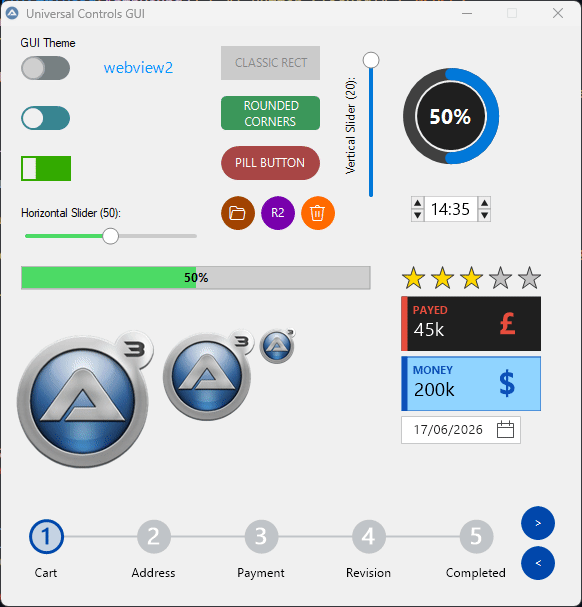

# 🎚️ UC_Framework
Universal Controls framework for custom GDI+ controls (Toggles, Sliders, etc.)

---


Hi everyone,

I'd like to share a project I've been working on: **UC\_Framework**. 
It is a lightweight framework designed to create modern, reactive, and highly customizable **GDI+ controls** for AutoIt.

My goal was to create a standardized, extensible way to introduce custom controls into AutoIt, moving away from static functions  
and towards a more "Object-Oriented" logic using **AutoIt Maps**

### Key Features:

- **Reactive Engine:** Property changes automatically trigger a redraw of the control.
- **Extensible Architecture:** The framework is designed as an "Engine."  
	Adding a new control (e.g., a Gauge or a Custom Listview) is just a matter of defining its properties in the Map and creating its Draw function.
- **Modern UI Elements:** Includes Toggles (Round/Rect), Sliders (Horizontal/Vertical), Custom Buttons (Classic/Rounded/Pill),,Links, labels, (more are coming).
- **Property Management:** Centralized property manager for easy control manipulation using
	```
	_UC_Set
	```
	and
	```
	_UC_Get
	```
  
- **Customization:** Full control over colors, corner radius, fonts, and tooltips.
- **Interactive:** Built-in support for hover states, click events, and keyboard accelerators.

### Technical Implementation:

The framework uses a **Global Map (ID 1)** to act as a Provider for system-wide constants, cursors, and shared resources,  
ensuring that your GUI remains lightweight and organized.

This framework is currently in its **early stages (Alpha)**.  
I am sharing it now because I want to establish a solid foundation and gather feedback on the architecture.

Ideas for new controls to be integrated into the library.



---

### worth noting

now you call UC_Framework with
```Autoit
#include "UC_Framework\UC_Framework.au3"
```

which functions as a **Central Manifest**, because

```Autoit
#include-once

;----------------------------------------------------------------------------------------
; Title...........: UC_Framework.au3
; Description.....: Universal Controls framework for custom GDI+ controls (Toggles, Sliders, etc.)
; Link............: https://github.com/ioa747/UC_Framework
; Link............: https://www.autoitscript.com/forum/topic/213667-uc_framework-universal-controls/
;----------------------------------------------------------------------------------------

#include "UC\Frame\UC_Frame.au3"

#Region ; ~~~~~~~~~~~~~ Components ~~~~~~~~~~~~~
#include "UC\UC_Toggle.au3"
#include "UC\UC_Slider.au3"
#include "UC\UC_Button.au3"
#include "UC\UC_Link.au3"
;~ #include "UC\UC_Label.au3"
;~ #include "UC\UC_Image.au3"
;~ #include "UC\UC_ProgressBar.au3"
;~ #include "UC\UC_RadialProgress.au3"
;~ #include "UC\UC_HourMinute.au3"
;~ #include "UC\UC_Rating.au3"
#include "UC\UC_InfoBox.au3"
#EndRegion ; ~~~~~~~~~~~~~ Components ~~~~~~~~~~~~~
```

The **`UC_Framework.au3`** file acts as your central configuration hub.  
Keep your compiled script lean by loading only the components you need.

Now **each new control** is a **standalone udf**  
which will be placed in the folder  ' **\UC_Framework\UC\**'  
and you add a reference here in **UC_Framework.au3**

Now each new control does **not need** to be imported into **__UC_Main_MsgHandler**  function. 

Now configure this with the **Registered Event Handlers** in the maps,  
thus allowing the use of only the Events that the control needs.

```Autoit
	Local $m[]
	; Universal Properties
	$m.UC_Type = $UC_TYPE_INFOBOX
	$m.UC_ControlID = $idDummy
	$m.UC_hWnd = $hChild
	$m.UC_hParent = $hParent

	; Registered Event Handlers
	$m["UC_WM_" & $WM_LBUTTONDOWN] = "_WM_LBUTTONDOWN"
	$m["UC_WM_" & $WM_LBUTTONDBLCLK] = "_WM_LBUTTONDBLCLK"
	$m["UC_WM_" & $WM_LBUTTONUP] = "_WM_LBUTTONUP"
;~ 	$m["UC_WM_" & $WM_RBUTTONDOWN] = "_WM_RBUTTONDOWN"
;~ 	$m["UC_WM_" & $WM_RBUTTONUP] = "_WM_RBUTTONUP"
	$m["UC_WM_" & $WM_MOUSEMOVE] = "_WM_MOUSEMOVE"
	$m["UC_WM_" & $WM_SETFOCUS] = "_WM_SETFOCUS"
	$m["UC_WM_" & $WM_KEYDOWN] = "_WM_KEYDOWN"
```

which correspond to the corresponding functions

```Autoit
Func _UC_InfoBox_WM_LBUTTONDOWN($idDummy, $hWnd, $iX, $iY)
Func _UC_InfoBox_WM_LBUTTONDBLCLK($idDummy, $hWnd, $iX, $iY)
Func _UC_InfoBox_WM_LBUTTONUP($idDummy, $hWnd, $iX, $iY)
Func _UC_InfoBox_WM_MOUSEMOVE($idDummy, $hWnd, $iX, $iY)
Func _UC_InfoBox_WM_SETFOCUS($idDummy, $hWnd, $iX, $iY)
Func _UC_InfoBox_WM_KEYDOWN($idDummy, $hWnd, $iKeyCode, $aXY)
```

The only **modification** that needs to be made to **UC_Framework** is to "**\UC_Framework\UC\Frame\UC_Frame_Generic.au3**"  
which needs to be imported into the **Global Enum** and into **$aUC_Types**    (making sure they have the same index)


```Autoit
Global Enum _
		$UC_TYPE_NONE, _
		$UC_TYPE_TOGGLE, _
		$UC_TYPE_SLIDER, _
		$UC_TYPE_BUTTON, _
		$UC_TYPE_LINK, _
		$UC_TYPE_LABEL, _
		$UC_TYPE_IMAGE, _
		$UC_TYPE_PROGRESSBAR, _
		$UC_TYPE_RADIALPROGRESS, _
		$UC_TYPE_HOURMINUTE, _
		$UC_TYPE_RATING, _
		$UC_TYPE_INFOBOX, _
		$UC_TYPE_MAX

Global Const $aUC_Types[] = [ _
    "None", _             ; $UC_TYPE_NONE
    "Toggle", _           ; $UC_TYPE_TOGGLE
    "Slider", _           ; $UC_TYPE_SLIDER
    "Button", _           ; $UC_TYPE_BUTTON
    "Link", _             ; $UC_TYPE_LINK
    "Label", _            ; $UC_TYPE_LABEL
    "Image", _            ; $UC_TYPE_IMAGE
    "ProgressBar", _      ; $UC_TYPE_PROGRESSBAR
    "RadialProgress", _   ; $UC_TYPE_RADIALPROGRESS
    "HourMinute", _       ; $UC_TYPE_HOURMINUTE
	"Rating", _           ; $UC_TYPE_RATING
	"InfoBox" _           ; $UC_TYPE_INFOBOX
]
```

The system will automatically link your  
**_UC_[Type]_Draw** and **_UC_[Type]_WM_[Event]** functions without modifying the core engine.

---

### Folder PATH listing for volume Data

```
PROJECT
│   Example1.au3
│   
└───UC_Framework
    │   UC_Framework.au3
    │   
    └───UC
        │   UC_Button.au3
        │   UC_HourMinute.au3
        │   UC_Image.au3
        │   UC_InfoBox.au3
        │   UC_Label.au3
        │   UC_Link.au3
        │   UC_ProgressBar.au3
        │   UC_RadialProgress.au3
        │   UC_Rating.au3
        │   UC_Slider.au3
        │   UC_Toggle.au3
        │   
        ├───Assets
        │       116386-ioa747.png
        │       1272.png
        │       260527-120731-420_AutoIt3_6dpJp.gif
        │       
        └───Frame
                UC_Frame.au3
                UC_Frame_GDI.au3
                UC_Frame_Generic.au3
                UC_Frame_Internal.au3
                UC_Frame_Map.au3
                UC_Frame_Timers.au3
                UC_Frame_WinAPI.au3
```
                
